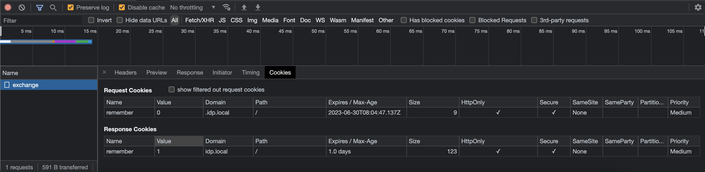

# Демо по установки авторизационных cookie

## Предварительные настройки

1. Добавить алиасы доменных имен /etc/hosts:

192.168.1.100 idp.local

192.168.1.100 site2.local

вместо 192.168.1.100 нужно указать ip-адрес компьютера, на котором запускается демо

2. Добавить корневой сертификат для self-signed сертификатов

Необходимо скачать утилиту mkcert (https://github.com/FiloSottile/mkcert/releases)

mkcert -install

После завершения работ с демо рекомендуется удалить добавленный корневой сертификат

mkcert -uninstall

## Структура репозитория

/site1 - сервер с защищенным ресурсом

/site2 - сервер, с которого хотим перейти на защищенный сервер

## Сервер site1

По умолчанию, доступен по адресу: https://idp.local:3000

### Запуск сервера

```
site1> npm install

site1> npm run dev

[nodemon] 2.0.22
[nodemon] to restart at any time, enter `rs`
[nodemon] watching path(s): *.*
[nodemon] watching extensions: js,mjs,json
[nodemon] starting `node server.js`
Express started on port 3000

```

### Доступные методы

* GET / - проверка достпуности сервера

* GET /exchange - устанавливает авторизационную cookie

* GET /forget - удаляет авторизационную cookie

* GET /restricted - доступ к защищенному ресурсу, <br>
Если установлена авторизационная cookie, то возвращается код 200 и тест "Restricted content", иначе возвращается код 401 и текст "Access denied"

## Сервер site2

По умолчанию, доступен по адресу: http://site2.local:3001

### Запуск сервера

```
site2> npm install

site2> npm run dev

[nodemon] 2.0.22
[nodemon] to restart at any time, enter `rs`
[nodemon] watching path(s): *.*
[nodemon] watching extensions: js,mjs,json
[nodemon] starting `node server.js`
Express started on port 3001

```

### Сценарий работы

#### Положительный сценарий

1. Открыть в браузаре адрес: http://site2.local:3001/index.html <br>
__Ожидаемый результат__: открылась веб-страница

2. Проверить корректность настроек:

    2.1. Поле Base Site1 URL должно содержать адрес, на котором доступен Site1. По умолчанию, значение: https://idp.local:3000

    2.2. Чек-бокс Token exchange __включен__

3. Нажать кнопку "Open Site 1"<br>
__Ожидаемый результат__: открылась новая вкладка по адресу https://idp.local:3001/restricted, которая содержит текст "Restricted content"

__Альтернативные результаты__: <br>
* При ошибки в настройках будет показано модальное окно с ошибкой, детали ошибки можно посмотреть в Console
* Если не была корректна установлена авторизационная cookie, то будет показано "Access denied" на открывшейся вкладке веб-браузера

#### Негативный сценарий

1. Открыть в браузаре адрес: https://idp.local:3000/forget <br>
  __Ожидаемый результат__: Cookie was cleaned

2. Открыть в браузаре адрес: http://site2.local:3001/index.html <br>
  __Ожидаемый результат__: открылась веб-страница

3. Проверить корректность настроек:

    2.1. Поле Base Site1 URL должно содержать адрес, на котором доступен Site1. По умолчанию, значение: https://idp.local:3000

    2.2. Чек-бокс Token exchange __выключен__

4. Нажать кнопку "Open Site 1"<br>
  __Ожидаемый результат__: открылась новая вкладка по адресу http://idps.local:3000/restricted, которая содержит текст "Access denied"

## Диагностика проблем

1. В браузере проверить, что нет проблем с самоподписанным сертификатом. Адрес http://idps.local:3000 открывается без предупреждений о невалидности сертификата

2. Вкладка cookies в Developer Tools должна содержать информацию о принятых cookie

    


